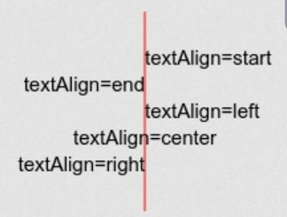

# Video juego con JS

## ¿Qué es canvas en JavaScript?

El elemento HTML **canvas** se puede utilizar para dibujar gráficos a través de secuencias de comandos (por lo general JavaScript ). Por ejemplo, puede usarse para dibujar gráficos, hacer composiciones de fotos o incluso realizar animaciones.

```javascript
// 1- Seleccionar el evento para manipular el canvas
const canvas = document.querySelector('#game');

// 2- crear el "contexto" para dibujar sobre canvas

const context = canvas.getContext("2d"); // De esta manera se podran utilizar todas las funciones predefinidas que tiene el canvas

// 2.1- Evento de ejecutar una función cuando se cargue la página

window.addEventListener('load', startGame());

// 3- Crear una función que cargue todos los elementos bàsicos de entreada para ejecutar el juego
function startGame() {
    context.fillRect(0,0,100,100); // indica en dónde comienza el rectángulo y en dónde termina, tiene 4 argumentos => Los dos primeros las coordenadas iniciales de x & y dentro del canvas, las dos siguientes las finales. Los parámetros pasados en este caso, crearía un cuadrado que inicia en (0, 0) y se desplaza 100px en el eje x y 100px en el eje y.

    context.clearRect(0,0,50,50); // tiene la misma lógica de la función anterior, pero en este caso no crea si no que BORRA dentro del contenido del canvas

    context.font = '24px Arial'; // Establece la fuente tipo Arial y tamaño 24px
    context.fillStyle('green'); // Seleccionar un color
    context.textAlign = 'end'; // Alinear el texto

    context.fillText('Platzi', 50, 50); // esta función permite agregar texto al Canvas. Tiene 3 argumentos, el string y la posicion en x & y
}

```

### Notas

* Si nos queremos mover de izquierda a derecha, manipulamos los valores de x, de arriba hacia abajo, manipulamos los valores de y.
* Es posible darle estilo a los textos, incluyendo su ubicación
* Alinear el texto con canvas - Esto se hace con base en el punto de coordenada asociado.



### Definir el tamaño del canvas

Haciendo lo *responsive*. Según las medidas que se quieran hacer, primero se debe calcular el tamaño del canvas para el ancho y el alto, en este caso que se necesita un cuadrado, que siempre sean iguales.

```javascript

function startGame() {

    let canvasSize; // Variable para ajustar las condiciones de tamaño dadas

    // Se necesita garantizar que el ancho y el alto siempre son iguales

    if (window.innerHeight > window.innerWidth) {
        canvasSize = window.innerWidth * 0.8;
    }
    else {
        canvasSize = window.innerHeight * 0.8;
    }
    // Asigna a canvasSize siempre el mismo tamaño para el ancho y para el alto


    canvas.setAttribute('width', canvasSize)
    canvas.setAttribute('height', canvasSize)

    const elementSize = canvasSize / 10; // inicialmente se está indicando que cada elemento dentro de la grilla del canvas tendrá un 10% del total de la caja

    // Considerando el aspecto *responsive*, es necesario hacer un pequeño ajuste al método que nos permite manipular el tamaño

    context.font = elementSize + 'px arial'; // element size será dinámico pues siempre estará tomando el valor del 10% de la caja y como está va cambiando de acuerdo al tamaño de la pantalla, a su vez irá ajustando el tamaño de los elementos a esto.

    textAlign = 'end';

    for (let i = 1; i <= 10; i++) {
        context.fillText(emojis['X'], elementSize * i, elementSize)
    }

    // De esta forma es posible agregar múltiples elementos a la grilla
}


```

### Canvas Responsive

Sin importar que cambien las medidas de la pantalla, es importante que el canvas siga teniendo el mismo tamaño, hasta el momento se ha posido ajustar parcialmente la solución a esto.

Inicialmente habría que crear un nuevo evento que permita ajsutar esto, el evento *resize* permite ejecutar una función cada vez que se reajuste el tamaño de la pantalla.

```javascript

window.addEventListener('resize', startGame); // cada vez que se reajuste el tamaño de la pantalla, ejecutará la función startGame

```

Lo ideal sería poder divider las funcionalidades del juego. Entonces se creará una función para ajusta el tamaño y otra para renederizar los elementos.

```javascript

// Se sacaran las dos vars a continaución de la lógica de la función startGame para poder usuarlas de manera global.

let canvasSize; // var para ajustar el tamaño del canvas a la pantalla
let elementsSize; // var para ajustar el tamaño de los elementos dentro del canvas 

function setCanvasSize() {
  if (window.innerHeight > window.innerWidth) {
    canvasSize = window.innerWidth * 0.8;
  } else {
    canvasSize = window.innerHeight * 0.8;
  }
  
  canvas.setAttribute('width', canvasSize);
  canvas.setAttribute('height', canvasSize);
  
  elementsSize = canvasSize / 10;

  startGame(); // Cada vez que renderice la imagen del canvas se ejecutará startGame - Con esto se consigue que los elementos dentro del canvas no se estén borrando cada vez que se hace un resize
}

function startGame() {
//   console.log({ canvasSize, elementsSize });

  game.font = elementsSize + 'px Arial'; // asignar tamaño dinámico
  game.textAlign = 'end'; // ajuste de texto

  for (let i = 1; i <= 10; i++) {
    game.fillText(emojis['X'], elementsSize, elementsSize * i);
  } // estrucutra para crear 10 elementos asociados al name X dentro del canvas, de acuerdo a las coordenadas elementsSize
}

```

## Mapa del juego

Para el caso de este ejercicio se trabajarán con arreglos bidimensionales

```javascript

// en este objeto se guardan a través de códigos "name" los valores que queremos imprimir en el canvas

const emojis = {
    '-': ' ',
    'O': '🚪',
    'X': '💣',
    'I': '🎁',
    'PLAYER': '💀',
    'BOMB_COLLISION': '🔥',
    'GAME_OVER': '👎',
    'WIN': '🏆',
  };

```

Los **template literals** nos permiten definir strings y sus respectivos saltos de línea sin la necesdad de imprimir más código o expresiones regulares.

Una manera básica para llenar el canvas a través de ciclos sería con un *for* anidado.

```javascript
for (let i = 1; i <= 10; i++) {
    // iterar las filas
    for (let j = 1; j <= 10; j++) {
        // iterar las columnas
        game.fillText(emojis['X'], elementsSize * i + 5, elementsSize * j);
    }
  }

```

El problema con esto, es que solo llenaría líneas con los valores asociados a X. A continaución se creará la lógica para poder asociar los mapas en *maps.js* a la lógica de *startGame()*.


```javascript
function startGame() {
//   console.log({ canvasSize, elementsSize });

  context.font = elementsSize + 'px Arial';
  context.textAlign = 'end';

  const map = maps[0]; // traería el primer elementos en el arreglo maps de maps.js

    // variable auxiliar filas - se va a llenar esta variable con las filas del arreglo, creando un arreglo de arreglos 

  const mapRows = maps[0].trim().split('\n'); // aplicando a un string str.split(''); podemos dividir el string con un valor por referencia dado. - aplicando el método trim() a un string se eliminan los espacios vaciós al comienzo y al final de este.

  // Variable auxiliar columnas - Existen espacios al comienzo de cada línea que también deben ser borrados. Para manipular las columnas, se debe ahora dividir cada fila por sus elementos.

  const mapCols = mapRows.map(row => row.trim().split('')); // con el método .map se creará un arreglo de arreglos, con cada una de las filas de 10 posiciones provenientes de maps[] - row va a representar cada una de las distintas filas - cada fila vuelve ya es un str, entonces se pueden aplicar sus métodos

  for (let i = 1; i <= 10; i++) {   
    
    for (let j = 1; j <= 10; j++) {

         context.fillText(emojis[mapCols[i - 1][j - 1]], elementsSize * j + 5, elementsSize * i);
    }
  }
}

```

#### Notas

* aplicando a un string *str.split('');* podemos dividir el string con un valor por referencia dado.
* aplicando el método *trim()* a un string se eliminan los espacios vaciós al comienzo y al final de este - Esto permitió limpiar el str por como estaba por diseño
* con el método .map se creará un arreglo de arreglos, con cada una de las filas de 10 posiciones provenientes de maps[] 
- row va a representar cada una de las distintas filas 
- cada fila vuelve ya es un str, entonces se pueden aplicar sus métodos. Nuevamente con *trim()* se limpiaran esos espacios indeseados y con *split()* se separará cada uno de los elementos.
- con *const mapCols* vos a poder mapear el mapa que tenga seleccionado, para posteriormente pasar a imprimir sus posiciones en el ciclo.
- context.fillText(emojis[mapCols[i - 1][j - 1]], elementsSize * j + 5, elementsSize * i); - Se le resta 1 a la *i* y a la *j* porque dado el funcionamiento de los ciclos anidados y para poder renderizar bien los elementos, fue necesario comenzar la iteración de los *for* en 1, así se toman e imprimen todos los elementos del mapa.

### Refactorizando el código anterior

La forma más apropiada de recorrer arrays es a través del método forEach.

```javascript

function startGame() {
//   console.log({ canvasSize, elementsSize });

  context.font = elementsSize + 'px Arial';
  context.textAlign = 'center';
  // const map = maps[0];
  const mapRows = maps[2].trim().split('\n'); // separar str por saltos de línea
  const mapCols = mapRows.map(row => row.trim().split('')); // separar fila por elemento
  
  mapCols.forEach((row, rowIndex) => {
    row.forEach((col, colIndex) => {
        const emoji = emojis[col]; // Esta var es la que va a recorrer los elementos del mapa en maps.emojis[]
        const xPosition = elemenstSize * (colIndex + 1); // var para definir la posicion dinámica de x
        const yPosition = elemenstSize * (rowIndex + 1); // var para definir la posicion dinámica de y
        context.fillText(emoji, xPosition, yPosition); // renderiza el elemento de emoji[xPosition][yPosition]
    });
  });

  // VS

  for (let i = 1; i <= 10; i++) {    
    for (let j = 1; j <= 10; j++) {
         context.fillText(emojis[mapCols[i - 1][j - 1]], elementsSize * j + 5, elementsSize * i);
    }
  }
}

```

#### Notas

* Debido a que para poder renderizar es necesario comenzar la iteración en 1, a las vars que se utlizan para la posición se les debe hacer ese pequeño ajuste como se muestra a continuación: <pre>const xPosition = elemenstSize * (colIndex + 1);</pre>
* Con *forEach* podemos aplicar una función a cada iteración, definiendo primero el valor al cual se le va asignar el resultadod de la función, y en este caso, un segundo parámetro para guardar el valor del ínidce de este mismo. <pre>mapCols.forEach((row, rowIndex) = {...}</pre>


#### Foreach

<pre>array.forEach(function(currentValue, index, arr), thisValue)</pre>

El método *forEach()* llama a una  función callback específica una vez por cada elemento sobre el que itera dentro de un arreglo. Al igual que otros iteradores de arreglos tales como *map y filter*, la función callback puede recibir tres parámetros.

**Acceder a la propiedad del índice con forEach()**. En este ejemplo, vamos a ejecutar la función  pasarLista por cada  uno de los estudiantes por los que se recorrió el bucle dentro del arreglo. La función pasarLista solamente registra en la consola una cadena perteneciente a cada uno de los estudiantes.

```javascript

nombres = ["anna", "beth", "chris", "daniel", "ethan"]

function pasarLista(nombre, indice) {
    console.log(`Está el numero de estudiante ${indice + 1}  -${nombre} - presente? Sí!`)
    ;}

numeros.forEach((nombre, indice) => pasarLista(nombre, indice));


/*
"Está el número de estudiante 1  - anna presente? Sí!"
"Está el número de estudiante 2  - beth presente? Sí!"
"Está el número de estudiante 3  - chris presente? Sí!"
"Está el número de estudiante 4  - daniel presente? Sí!"
"Está el número de estudiante 5  - ethan presente? Sí!"
*/

```

Si se asigna un nombre al segundo parámetro del *forEach()*, **este valor irá tomando el de cada iteración que se haga**. Es decir, sería el valor homólogo de la habitual *i* que se usa en los ciclos "*for ( ) {...}*".

## Movimientos del jugador

Para detectar los movimientos del jugador, se trabajrá con *AddEventListener*, método que a partir de un **evento**, ejecuta una función.

```javascript

// crear las variables para identificar loseventos desde el HTML

const btnUp = document.querySelector('#up');
const btnRight = document.querySelector('#right');
const btnLeft = document.querySelector('#left');
const btnDown = document.querySelector('#down');

// Crear los eventos para los botones

btnUp.addEventListener('click', moveUp);
btnRight.addEventListener('click', moveRight);
btnLeft.addEventListener('click', moveLeft);
btnDown.addEventListener('click', moveDown);

//  Crear los eventos para las teclas - Con el evento *keydown* indico que es cuando el usuario presiona la tecla.

window.addEventListener('keydown', keysMove);

// Crear las funciones para cada movimiento - Dada la complejidad, se debe crear una función por movimiento.


function keysMove(event) {
  // console.log(event);

  // Através de una estructura condicional se debe validar que código está llegando y a partir de ahí, ejecutar las funciones.

  let tecla = event.key;

  switch (tecla) {
    case "ArrowUp":
      moveUp();
      break;

    case "ArrowDown":
      moveDown();
      break;

    case "ArrowLeft":
      moveLeft();
      break;

    case "ArrowRight":
    moveRight();
      break;

    default:
      break;
  
  }

}

function moveUp() {

}

function moveRight() {
  
}
function moveLeft() {
  
}
function moveDown() {
  
}

```

### Notes

* Si requiero ejecutar una función o acción cuando un usuario de click sobre un obtón u otro elemento, utilizo el método *addEventListener('EVENTO', FUNCION)*
* Para el caso del ejercicio se quiere que con la tecla "flecha arriba" se tenga la misma funcionalidad que con el botón "Up". Para esto, análogamente al caso anterior, se utilizará el *window.addEventListener('EVENTO', FUNCION)* - Con el evento *keydown* indico que es cuando el usuario presiona la tecla - Se deberá crear una lógica que permita recoger el evento de la tecla que el usuario oprima, lea su código y ejecute el respectivo movimiento asociado a la tecla.

## Lograr que se mueva el jugador

Se tendrá un objeto *playerPosition* donde se van a guardar los movimientos que realice el jugador.

```javascript

// Dentro de startGame - Dentro del forEach anidado => Con este condicional añado la lógica para renderizar la calabera

if (col == 'O') {
        playerPosition.x = posX;
        playerPosition.y = posY;
        console.log({playerPosition});
      }

// Objeto para conocer las coordenadas del elemento Player

const playerPosition = {
  x: undefined,
  y: undefined,
};

// Función para renderizar el elemento PLAYER de emojis[] dadas ñas coordenadas del elemento

function movePlayer () {
  context.fillText(emojis['PLAYER'], playerPosition.x, playerPosition.y);
}

function moveUp() {
  console.log('Me quiero mover hacia arriba');
  playerPosition.y -= elementsSize; // Como esta función mueve el player hacia arriba, se desplaza por el eje y, por eso sea accede a ese valor
  movePlayer();
}
function moveLeft() {
  console.log('Me quiero mover hacia izquierda');
}
function moveRight() {
  console.log('Me quiero mover hacia derecha');
}
function moveDown() {
  console.log('Me quiero mover hacia abajo');
}

```

### Notes

* Recuerde que con canas y html las coordenadas (0, 0) comienzan en el punto de la esquina superior izquierda. Entonces si quiero moverme hacia ARRIBA debo restar en el EJE Y, si quiero moverme hacia ABAJO debo sumar en el EJE Y; si quiero moverme hacia la DERECHA debo sumar en el EJE X y si quiero moverme hacia la IZQUIERDA, debo restar en el EJE X.

A este punto existen algunos inconvenientes, primero, PLAYER se mueve, pero el render anterior queda fijo, se requiere inicialmente, LIMPIAR ese camino que se ha dejado. El otro problema sería que PLAYER se puede salir del **canvas**, lo cual no se debería permitir.

```javascript

function startGame() {
//   console.log({ canvasSize, elementsSize });

  context.font = elementsSize + 'px Arial';
  context.textAlign = 'center';
  const map = maps[0];
  const mapRows = map.trim().split('\n'); // separar str por saltos de línea
  const mapCols = mapRows.map(row => row.trim().split('')); // separar fila por elemento

  context.clearRect(0, 0, canvasSize, canvasSize); // BORRARÁ todos los elementos del canvas desde la posición (0, 0) hasta el tamaño que tenga el canvas de acuerdo a la pantalla.

  mapCols.forEach((row, rowIndex) => {
    row.forEach((col, colIndex) => {
        const emoji = emojis[col]; // Esta var es la que va a recorrer los elementos del mapa en maps.emojis[]
        const xPosition = elementsSize * (colIndex + 1); // var para definir la posicion dinámica de x
        const yPosition = elementsSize * (rowIndex + 1); // var para definir la posicion dinámica de y


        // Se debem modificar este if, anidandolo, así una vez se defina la posición inicial no se siga renderizando una y otra vez a la posición de partida.

        if (col == 'O') {
          // 'O' es lo que me permite tomar el valor de la Calavera
          if (!playerPosition.x && !playerPosition.y) {
            //  Si pP.x y pP.y TIENEN algún valor, esta condición sería falsa, por lo tanto ejecuta el código - En caso contrario. no sigue retornando a PLAYER a la posición inicial.

            playerPosition.x = xPosition;
            playerPosition.y = yPosition;
            console.log({playerPosition});            
          }
        }

        context.fillText(emoji, xPosition, yPosition); // renderiza el elemento de emoji[xPosition][yPosition]
    });
  });


  movePlayer();
}

function movePlayer () {
  context.fillText(emojis['PLAYER'], playerPosition.x, playerPosition.y);
}

function moveUp() {
  console.log('Me quiero mover hacia arriba');
  playerPosition.y -= elementsSize; 
  startGame();

  // Dado que movePlayer() ya está dentro de la lógica de startGame();, se ejecutará esta última mejor, pues ya añade la lógica para borrar el rastro de PLAYER
}

// Replicamos la lógica de moveUp a las demás funciones - Recordar que para moverme hacia arriba y hacia abajo debo modificar la POSICIÓN en Y, y para moverme de izquierda a derecha, la POSICIÓN en X.

function moveRight() {
  playerPosition.x += elementsSize; 
  startGame();
}
function moveLeft() {
  playerPosition.x -= elementsSize; 
  startGame();
}
function moveDown() {
  playerPosition.y += elementsSize; 
  startGame();
}

```

* *context.ClearRect(0, 0, canvasSize, canvasSize);* => Primero, para facilitar el ejercicio y considerando que es algo pequeños, para lograr que se borre el camino de PLAYERS, se va a borrar y a renderizar TODO una y otra vez que se ejecute *startGame()* - El problema es que si solo con esta propiedad, la imagen sería estática, debido al condicional que se creo para renderizar PLAYER.

Ahora se va a solucionar el problema para que no se salga del canvas.

Para esto será necesario hacer una **validación** en la que se garantice que las funciones se vas a ejecutar, solo cuando los elementos no superen el tope de los límites del canvas

```javascript

function moveUp() {
  console.log('Me quiero mover hacia arriba');
  if ((playerPosition.y - elementsSize) < elementsSize) {
    console.log('OUT of canvas');
  }else {
    playerPosition.y -= elementsSize; 
    startGame();
  }
}

function moveRight() {
  if ((playerPosition.x + elementsSize) > canvasSize) {
    console.log('OUT of canvas');
  }else {
    playerPosition.x += elementsSize; 
    startGame();
  }
}
function moveLeft() {
  if ((playerPosition.x - elementsSize) < elementsSize) {
    console.log('OUT of canvas');
  }else {
    console.log(playerPosition.x);
    playerPosition.x -= elementsSize; 
    startGame();
  }
}
function moveDown() {
  if ((playerPosition.y + elementsSize) > canvasSize) {
    console.log('OUT of canvas');
  }else {
    playerPosition.y += elementsSize; 
    startGame();
  }
}


```

### Notes

* *if ((playerPosition.y - elementsSize) < elementsSize) { OUT }* => Acá estoy validando que si la posción del PLAYER en el eje Y es menor al eje horizontal superior. - Una precaución, lo ideal sería validar con ( ... < 0), sin embargo, se hace con elementsSize porque es importante tener en cuenta el tamaño del elemento en sí. - Esto funciona para el borde horizontal superior y el lateral izquierdo, solamente
* Para validar el lateral derecho y horizontal superior, la validación no se hará respecto a *elementsSize*, sino frente al *canvasSize*, pues estos bordes representan los puntos máximos tanto para x como para y.

## Colisiones

### Colisiones fijas

Debemos identificar dónde están los elementos que van a interactuar con PLAYER. ¿Qué pasará cuando las coordenadas de uno coincidan con los demás elementos del canvas?

```javascript

// Objeto para identificar la posición del regalos

const giftPosition = {
  x: undefined,
  y: undefined,
};

// Con esta estrucutra identificabamos previamente la posición de la calavera
if (col == 'O') {
  if (!playerPosition.x && !playerPosition.y) {
      playerPosition.x = xPosition;
      playerPosition.y = yPosition;
      console.log({playerPosition});            
  }
  // La lógica para identificar la del regalo será similar. - I representa el emoji regalo en maps.js
  else if (col == 'I') {
    giftPosition.x = xPosition;
    giftPosition.y = yPosition;
    // Así guardamos las coordenadas del regalo
  }

}

function movePlayer () {

  // Guardaremos el evento colisión, que representa que las coordenadas de player y gift sean iguales. - Esta validación se debe hacer en ambos ejes. - Debemos redondear un poco el valor de las coordenadas para evitar problemas con los decimales.

  const giftCollisionX = playerPosition.x.toFixed(3) == giftPosition.x.toFixed(3); // Si esto se cumple devuelve TRUE
  const giftCollisionY = playerPosition.y.toFixed(3) == giftPosition.y.toFixed(3); // Si esto se cumple devuelve TRUE

  const giftCollision = giftCollisionX && giftCollisionY; // Si ambos son TRUE retorna TRUE

  if (giftCollision) {
    // Si gift collision es TRUE ejecuta
    console.log("Pasaste");
  }

  context.fillText(emojis['PLAYER'], playerPosition.x, playerPosition.y);
}

```

* cuando trabajamos con objetos y funciones podemos usar la palabra *const* porque estas no funcionan igual que las variables constantes como tal.
* La función *toFixed( n )* me permite ajustar los decimales de un número dado el parámetro. Esto servirá para evitar los problemas con los decimales mencionados.

En el ejercicio anterior **detectamos** la colisión de PLAYER con GIFT, pero GIFT está en una sola posición, qué pasa cuando queremos detectar colisiones de un objeto cuya posición no es fija?.

Para esto se deberá crear un **arreglo** y comparar elemento a elemento en busca de coinicidencias. En el arreglo vamos a ir insertando la posición de los enemigos tras cada render.

```javascript

// Crear el arreglo que guardará la posición de los enemigos

let enemiesPosition = []; // Se declara como let porque deberemos cambiar su valor en cada render

function startGame() {
//   console.log({ canvasSize, elementsSize });

  context.font = elementsSize + 'px Arial';
  context.textAlign = 'center';
  const map = maps[0];
  const mapRows = map.trim().split('\n'); 
  const mapCols = mapRows.map(row => row.trim().split('')); 

  context.clearRect(0, 0, canvasSize, canvasSize);

  // Debido a que el array se ejectuta dentro de startGame este estaría llenandose de la  n cantidad de elementos enemigos en cada render, es por esto que también se debe limpiar el array en cada render para posteriormente volverse a llenar. - Esto se hará simplemente redeclarandolo como vacío

  enemiesPosition = [];

  mapCols.forEach((row, rowIndex) => {
    row.forEach((col, colIndex) => {
        const emoji = emojis[col]; 

        if (col == 'O') {
          if (!playerPosition.x && !playerPosition.y) {
            playerPosition.x = xPosition;
            playerPosition.y = yPosition;
            console.log({playerPosition});            
          }
        }
        else if (col == 'I') {
          giftPosition.x = xPosition;
          giftPosition.y = yPosition;    
        }

        // Guardar la posición de los enemigos en el arreglo. - Se llenará el array con el método push con cada una de las coordenadas que coincidan con el elemento X.

        else if (col == 'X') {
          enemiesPosition.push({
            x: xPosition,
            y: yPosition,
          });
        }

        context.fillText(emoji, xPosition, yPosition); 
    });
  });

function movePlayer () {
  const giftCollisionX = playerPosition.x.toFixed(3) == giftPosition.x.toFixed(3);
  const giftCollisionY = playerPosition.y.toFixed(3) == giftPosition.y.toFixed(3);
  const giftCollision = giftCollisionX && giftCollisionY;

  // A través del método find() vamos a recorrer todo el array y si alguno de los elementos coincide, lo retornara. - Recorre el array enemiesPosition[] comparando la posicion de los enemigos con la del player, si coinciden, se asigna a la variable, misma lógica en ambos ejes. - Returna TRUE si se cumple en ambos ejes

  const enemiesCollision = enemiesPosition.find(enemy => {
    const enemyCollisionX = enemy.x.toFixed(3) == playerPosition.x.toFixed(3);
    const enemyCollisionY = enemy.y.toFixed(3) == playerPosition.y.toFixed(3);
    return enemyCollisionX && enemyCollisionY;
  });

  if (giftCollision) {    
    console.log("Pasaste");
  }
  else if (enemiesCollision) {
    console.log("Moriste");
  }

  context.fillText(emojis['PLAYER'], playerPosition.x, playerPosition.y);
}

```

### Agregando las funcionalidades cuando se llega a GIFT o ENEMY

Hasta el momento el nivel del mapa se está ingresando manualmente. A continuación se dinamizará un poco esto, creando una variable level y consecuentemente una función que permita incrementar la variable cada vez que PLAYER coincida con GIFT.

```javascript

let level = 0; // debemos iniciarla en 0 ya que los mapas entán dentro de array

function movePlayer () {
  const giftCollisionX = playerPosition.x.toFixed(3) == giftPosition.x.toFixed(3);
  const giftCollisionY = playerPosition.y.toFixed(3) == giftPosition.y.toFixed(3);
  const giftCollision = giftCollisionX && giftCollisionY;
  const enemiesCollision = enemiesPosition.find(enemy => {
    const enemyCollisionX = enemy.x.toFixed(3) == playerPosition.x.toFixed(3);
    const enemyCollisionY = enemy.y.toFixed(3) == playerPosition.y.toFixed(3);
    return enemyCollisionX && enemyCollisionY;
  });


  if (giftCollision) {        
    levelWin();
    startGame();
  }
  else if (enemiesCollision) {
    console.log("Moriste");
  }

  context.fillText(emojis['PLAYER'], playerPosition.x, playerPosition.y);
}

function levelWin () {
  console.log("Pasaste");
  level++;
}

function gameWin () {
  console.log("ganaste");
}

// Dentro de startGame()

const map = maps[level];

if (!map) {
  // validaré que maps no esté tomando ningún valor
  gameWin();
  return;
  // Return permitará que se interrumpa la ejecución pero sin romperse
}

```

* La lógica del juego está condicionada por la cantidad de mapas. - Se debe crear una validación que cuando el arreglo map supere su ínidice, es decir, se hayan pasado todos los mapas, se ejecute la función gameWin

## Derrotas -  Perdiendo vidas

Si antes creamos una función para manipular qué pasaba con el jugado cuando pasaba de nivel, ahora será necesario hacerlo cuando este colisiona un enemigo o pierde. También se le agregará una variable de 'vidas', que represente la cantidad de intentos disponibles y que si se agotan, te lleven hasta el punto inicial del primer mapa, sin importar dónde estás.

```javascript

function movePlayer () {
  const giftCollisionX = playerPosition.x.toFixed(3) == giftPosition.x.toFixed(3);
  const giftCollisionY = playerPosition.y.toFixed(3) == giftPosition.y.toFixed(3);
  const giftCollision = giftCollisionX && giftCollisionY;
  const enemiesCollision = enemiesPosition.find(enemy => {
    const enemyCollisionX = enemy.x.toFixed(3) == playerPosition.x.toFixed(3);
    const enemyCollisionY = enemy.y.toFixed(3) == playerPosition.y.toFixed(3);
    return enemyCollisionX && enemyCollisionY;
  });


  if (giftCollision) {    
    levelWin();
    
  }
  // Validar si las coordenadas de PLAYER coinciden con ENEMY
  else if (enemiesCollision) {    
    levelFailed();
  }

  context.fillText(emojis['PLAYER'], playerPosition.x, playerPosition.y);
}

// Debe crearse entonces la función para cuando pierda. - Se debe hacer que PLAYER vuelva a la posición inicial si choca, para esto solo se trandrá dar el valor de UNDEFINED a las posiciones de x y y. - Posteriormente se deberá ejecutar startGame() para que renderice nuevamente.

// Defino una variable para saber cuátas vidas tengo.
let lives = 3;

function levelFailed() {
  // Si se ejecuta esta función significa que pierdo una vida
  lives--; // resto 1 a lives cada vez que se ejecuta la función

  if (lives <= 0) {

    // Asiganado a level el valor 0, resestería el juego hasta el primer mapa.
    level = 0;

    // De igual manera, debemos hacer un reset de las vidas para manejar mejor la variable.
    lives = 3;
  }
  

  // Estos valores se deben ejecutar siempre que ejecute levelFailed()
  console.log("Failed");
  playerPosition.x = undefined;
  playerPosition.y = undefined;
  startGame();
}

```